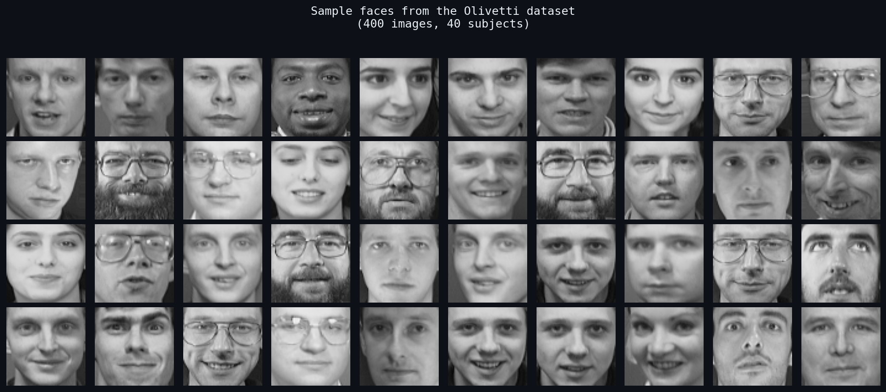
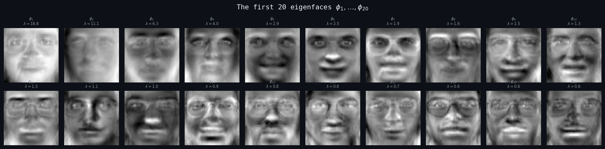
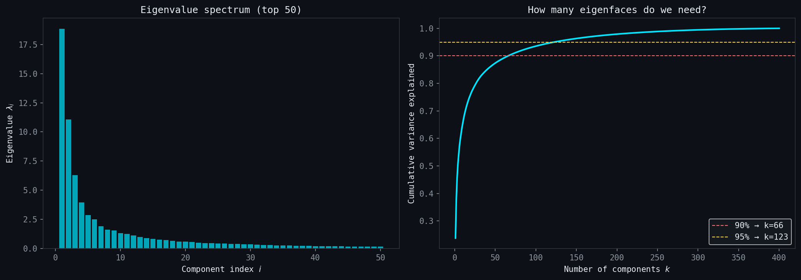
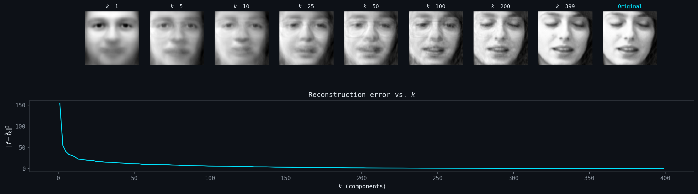

# Eigenfaces: The Spectral Theorem in the Wild

**A live coding masterclass connecting pure linear algebra to machine learning.**

>Made by Tonatiuh Matos Wiederhold for MAT224: Linear Algebra II

---

The covariance matrix is symmetric. The Spectral Theorem guarantees it decomposes into a sum of rank-1 projections. Here's what those projections look like when your data is a set of human faces.

---

## The Math

```
C = (1/n) X̃ᵀX̃         (symmetric, positive semidefinite)
C = Σᵢ λᵢ φᵢ φᵢᵀ       (Spectral Theorem)
f̂_k = f̄ + Σᵢ₌₁ᵏ ⟨f−f̄, φᵢ⟩ φᵢ    (reconstruction with k terms)
```

---

## What's in the Repo

- **`notebook/eigenfaces_lecture.ipynb`** A step-by-step walkthrough of PCA via eigendecomposition of the covariance matrix, built for live lecture delivery. Every computation is from first principles using NumPy. Heavily commented, sectioned with descriptive markdown cells containing $\LaTeX$.

- **`app/app.py`** A polished interactive Streamlit demo. Visitors can explore eigenfaces, watch a face reconstruct term by term, and upload their own photo.

---

## Running Locally

```bash
git clone https://github.com/tonamatos/EigenFaces
cd eigenfaces
pip install -r requirements.txt

# Notebook:
jupyter lab notebook/eigenfaces_lecture.ipynb

# App:
streamlit run app/app.py
```

---

## Live Demo

[Live demo →](https://mathnote.site/note/94YyRgjNDG)

---

## For Instructors

The notebook is designed to be studied, then rebuilt live. Each section is self-contained: you can run it sequentially for demonstration, or delete cells and re-derive the code in front of an audience. Variable names are fixed throughout (`X`, `mean_face`, `X_centered`, `eigenfaces`, `eigenvalues`, `coords`, `cumvar`) so students can follow along without mental translation. The dark matplotlib theme matches the Streamlit app, reinforcing visual continuity between the lecture and the interactive demo.

---

## Gallery








